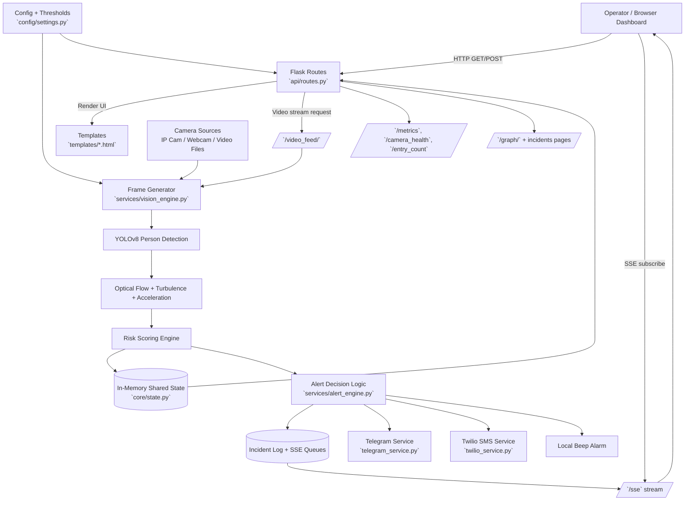

# System Architecture Flow Chart

This document describes the runtime architecture of `evacuAI-main` (StampedeGuard Pro).

## High-Level Flow

## Component Responsibilities

- `app.py`: Flask entry point and blueprint registration.
- `api/routes.py`: Dashboard, camera streams, metrics APIs, SSE endpoint, and control actions.
- `services/vision_engine.py`: Per-frame pipeline (orientation, YOLO detection, optical flow analytics, risk computation, overlays, stream encoding).
- `core/state.py`: Global thread-shared runtime state (metrics, history, incident logs, alert cooldowns, SSE client queues).
- `services/alert_engine.py`: Critical/high alert persistence logic, cooldown checks, incident recording, and outbound notification triggers.
- `telegram_service.py` + `twilio_service.py`: External notification adapters.
- `config/settings.py`: Camera sources, ROI definitions, density thresholds, flow parameters, and alert timing constants.

## Runtime Sequence (Per Camera)

1. Client requests `GET /video_feed/<camera>`.
2. Route invokes `generate_frames(camera)` from `vision_engine`.
3. Engine reads camera frame, applies orientation + resize.
4. YOLOv8 detects persons; ROI density and optical-flow features are computed.
5. Composite risk score and risk level are derived.
6. Shared state is updated (`camera_metrics`, `crowd_history`, health/fps).
7. Alert engine evaluates persistence + cooldown and triggers notifications if needed.
8. Annotated JPEG frame is streamed back to dashboard in multipart format.

## External Integrations

- **Telegram Bot API** for text/image/voice alerts.
- **Twilio API** for SMS alerts.
- `.env` secrets loaded at startup (`python-dotenv`).
